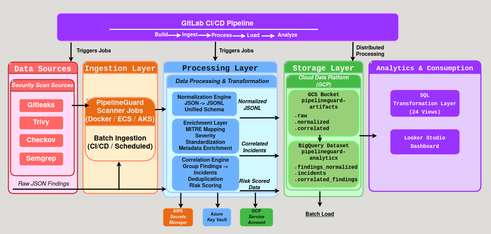

# 🚀 PipelineGuard — Multi-Cloud Security Data Engineering Platform

<p align="center">
  
</p>

<p align="center">
  <em>Figure: PipelineGuard Multi-Cloud Data Engineering Architecture</em>
</p>

---

## 📌 Overview

**PipelineGuard** is a **data engineering platform for security analytics** that ingests, transforms, and analyzes vulnerability data across modern CI/CD pipelines.

It converts raw security scan outputs into **structured, analytics-ready datasets**, enabling:

- Cross-tool vulnerability correlation  
- MITRE ATT&CK mapping  
- Risk-based prioritization  
- Scalable analytics and reporting  

---

## 🏗️ Architecture

PipelineGuard follows a **modern batch-oriented data pipeline architecture**:


```text
Sources → Ingestion → Processing → Storage → Analytics → Visualization
```
---

## 🔎 Architecture Overview

### 🔴 Data Sources
Security tools generate raw findings:
- Gitleaks (secrets detection)  
- Trivy (container & dependency vulnerabilities)  
- Checkov (IaC misconfigurations)  
- Semgrep (code-level issues)  

Output:

```json
Raw JSON scan results
```

---

### 🟠 Ingestion Layer

- Docker-based execution (local development)  
- AWS ECS (batch jobs)  
- Azure AKS (distributed workers)  
- GitLab CI/CD orchestration  

Output:

```json
Raw scan artifacts (JSON)
```
---

### 🔵 Processing Layer (Core Data Engineering)

#### ✅ Normalization
- Converts tool-specific outputs into a unified schema  
- Transforms JSON → JSONL  
- Standardizes severity and metadata  

#### ✅ Enrichment
- MITRE ATT&CK mapping  
- Metadata augmentation  
- Severity normalization  

#### ✅ Correlation
- Groups findings into incidents  
- Deduplicates overlapping signals  
- Applies risk scoring  

Output:

```json
Normalized + Correlated JSONL datasets
```

---

### 🟢 Storage Layer

#### Data Lake — GCS

* Stores raw and processed artifacts
* Structure:

```json
gs://pipelineguard-artifacts/
  ├── raw/
  ├── normalized/
  └── correlated/
```

#### Data Warehouse (BigQuery)

Dataset:

```json
pipelineguard_analytics
```

Tables:

* `findings_normalized`
* `incidents`
* `correlated_findings`

Data is loaded from GCS using batch load jobs.

---

### 🟣 Analytics Layer

#### SQL Transformation Layer
- 24 analytical views  
- Severity distribution  
- MITRE mapping  
- Risk scoring  
- Incident aggregation  

#### Visualization
- Looker Studio dashboards  
- Real-time exploration of security posture  

---

## ☁️ Multi-Cloud Architecture

| Cloud | Role |
|------|------|
| **AWS ECS (Fargate)** | Batch compute for scanning & processing | [Future Enhancements] |
| **Azure AKS** | API layer + distributed workers | [Future Enhancements] |
| **GCP** | Data lake (GCS) + Data warehouse (BigQuery) + Analytics | [MVP] |

## 🐳 Containerized Components

| Component | Description |
|----------|------------|
| `pipelineguard-scanners` | Executes security scans (ingestion) |
| `pipelineguard-runtime` | Normalization + correlation engine |
| `gcp-jobs` | BigQuery + GCS operations |

---

## ⚙️ CI/CD Pipeline

Implemented using **GitLab CI/CD**

### Stages

```text
Build → Ingest → Normalize → Correlate → Validate → Load → Transform → Deploy
```

Responsibilities:
- Build and push containers  
- Execute data pipelines  
- Upload artifacts to GCS  
- Load data into BigQuery  
- Apply SQL views  
- Deploy to AWS & Azure  

---

## 🗂️ Project Structure

```text
pipelineguard/
│
.
.
.
├── scripts/
│   ├── run_phase1.sh
│   ├── run_phase2.sh
│   ├── normalize_*.py
│   ├── correlate_findings.py
│   └── validate_*.py
│
├── sql/
│   └── views/
│
├── outputs/
├── normalized/
├── correlated/
│
├── Dockerfile.runtime
├── Dockerfile.scanners
├── .gitlab-ci.yml
│
├── docs/
│ ├── images/
│ │ └── pipelineguard-architecture.png
│ └── diagrams/
│ └── pipelineguard-architecture.drawio
.
.
.
```

## 📊 Data Flow Summary

```text
Security Tools → JSON → Normalize → Enrich → Correlate
              → GCS → BigQuery → Views → Dashboard
```

---

## 🔧 Architecture Diagram Source

👉 [Edit in draw.io](https://app.diagrams.net/?url=https://gitlab.com/datatalks.club/pipelineguard/-/raw/pipelineguard-arch-mvp/docs/diagrams/pipelineguard-dezoomcamp.drawio)

---

## 🔐 Security & Secrets

* AWS Secrets Manager
* Azure Key Vault
* GCP Service Accounts

Environment variable:

GOOGLE_APPLICATION_CREDENTIALS=/path/to/key.json

---

## 📈 Future Enhancements

* Streaming ingestion (Kafka / Kinesis)
* ML-based anomaly detection
* Automated remediation workflows
* SBOM integration (Syft / Grype)
* Policy-as-code (OPA / Rego)
* Multi-cloud compute separation

## 🎯 Key Data Engineering Concepts

* Batch data pipelines
* Schema normalization (JSON → JSONL)
* Data lake + warehouse architecture
* SQL-based analytical modeling
* Data validation and observability

---

## 👤 Author

**Md Hasan**
Cloud Platform Security | Data Engineering | DevSecOps

---

⭐ Summary

PipelineGuard demonstrates how security telemetry can be transformed into a scalable data engineering platform, enabling:

Unified visibility across tools
Data-driven risk prioritization
Enterprise-grade analytics

---